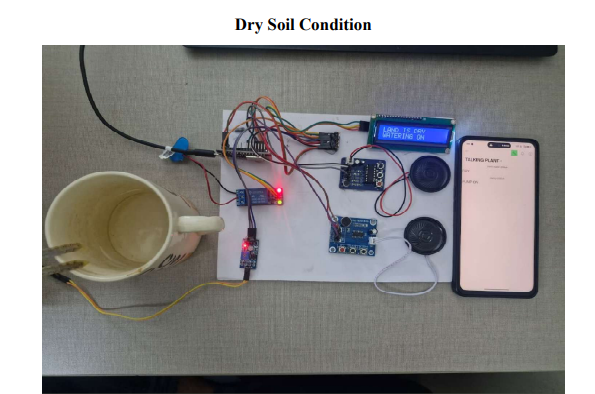
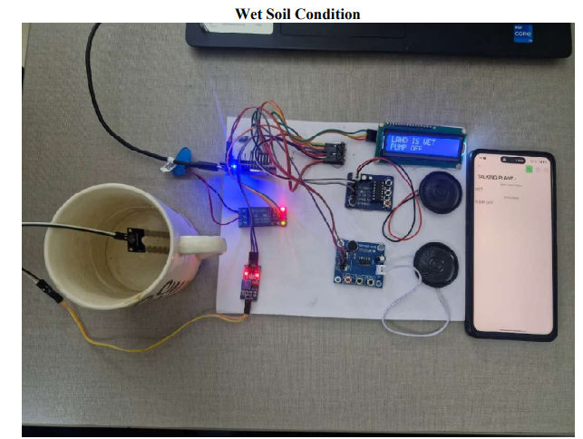

# 🌱 Plantie Talks

A smart talking plant pot that helps users understand plant care.

## 🚀 Features
- Detects soil moisture
- Gives voice feedback
- Displays messages

## 🛠️ Tech Used
- Arduino
- Soil Moisture Sensor
- LCD Display
- Voice Module

## 📸 Images

## 🎥 Demo
Download and watch: plantie.mp4
